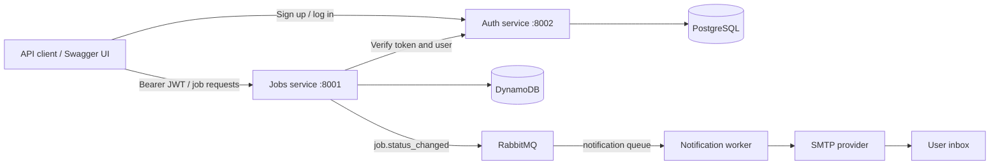

# Job Tracker

[](https://github.com/gauravdurge-2332/JobTracker/actions/workflows/ci.yml)
[](services/auth-Service/Dockerfile)
[](services/job_services/app/main.py)

A backend for tracking job applications, with JWT authentication and email notifications when an application's status changes. Three services separate account management, application tracking, and email delivery. Docker Compose runs the stack locally and on AWS EC2; GitHub Actions tests the code and publishes service images to GHCR.

The full flow has been verified on EC2: sign up, log in, create an application in DynamoDB, change its status, and receive an email through RabbitMQ and the notification worker.

## Contents

- [Features](#features)
- [Architecture](#architecture)
- [Run locally](#run-locally)
- [Try the API](#try-the-api)
- [Configuration](#configuration)
- [Tests and lint](#tests-and-lint)
- [CI and container images](#ci-and-container-images)
- [AWS deployment](#aws-deployment)
- [Troubleshooting](#troubleshooting)
- [Repository layout](#repository-layout)
- [Current limitations](#current-limitations)

## Features

- Account registration, password hashing with Argon2, and JWT login.
- Create, list, retrieve, update, and delete job applications belonging to the authenticated user.
- Track company, role, status, application date, and notes.
- Send status-change events through a RabbitMQ topic exchange.
- Deliver email asynchronously using SMTP with STARTTLS.
- Use DynamoDB Local during development and real DynamoDB with an EC2 IAM role in production.
- Build and publish separate container images for all three application services.

## Architecture



| Service | Responsibility | Storage / dependency |
|---|---|---|
| `auth-service` | Register users, issue JWTs, verify identity | PostgreSQL, SQLAlchemy, psycopg |
| `jobs-service` | Manage job applications and publish status changes | DynamoDB, auth-service, RabbitMQ |
| `notification-service` | Consume events and send emails | RabbitMQ, SMTP; no HTTP API |

Jobs are partitioned by `user_id`, with a UUID `id` as the sort key. Both DynamoDB keys are strings. The jobs service converts the numeric user ID returned by auth into a string before accessing the table.

A status update writes the job first, then publishes a background event to exchange `jobs` with routing key `job.status_changed`. The worker consumes the durable `notification` queue and emails the authenticated user's registered address. Creating a job or updating it without changing its status does not send an email.

## Run locally

### 1. Get the repository

Install Docker with the Compose v2 plugin, then clone the project:

```bash
git clone https://github.com/gauravdurge-2332/JobTracker.git
cd JobTracker
```

The Dockerfiles supply Python and dependencies; a host Python installation is only needed for running tests outside containers.

### 2. Set environment values

Copy [.env.example](.env.example) to `.env`:

```bash
# Linux / macOS
cp .env.example .env
```

```powershell
# Windows PowerShell
Copy-Item .env.example .env
```

Replace the placeholder database password, JWT secret, SMTP address, and SMTP password. Use a long random JWT secret. With Gmail, use a new app password rather than your account password; [Google's setup instructions](https://support.google.com/mail/answer/185833) explain the 2-Step Verification requirement. Remove spaces from the displayed app password before saving it.

The local Compose file fixes SMTP to `smtp.gmail.com:587`. To use another STARTTLS provider locally, update that service's SMTP host and port in `docker-compose.yaml`.

### 3. Start dependencies and the notification worker

Start the worker first so its queue exists before job events are published:

```bash
docker compose -f docker-compose.yaml up -d --build auth-db dynamodb rabbitmq notification-service
docker compose -f docker-compose.yaml logs --tail=50 notification-service
```

Wait for `Notification worker ready: consuming job.status_changed`, then start the APIs:

```bash
docker compose -f docker-compose.yaml up -d --build auth-service jobs-service
docker compose -f docker-compose.yaml ps
```

Auth creates its database tables on startup. Jobs creates the local DynamoDB `jobs` table when its local endpoint is configured. DynamoDB Local has no healthcheck in this Compose file; if jobs starts before it is ready, wait for DynamoDB and restart `jobs-service`.

### 4. Open the services

| Local URL | Purpose |
|---|---|
| http://localhost:8002/docs | Auth Swagger UI |
| http://localhost:8001/docs | Jobs Swagger UI |
| http://localhost:8001/health | Jobs process health |
| http://localhost:15672 | Development RabbitMQ management UI (`guest` / `guest`) |

The local `dummy` AWS credentials in Compose are for DynamoDB Local only. Production uses the instance IAM role. Local Postgres persists in `auth-db-data`; local DynamoDB and RabbitMQ have no mounted data volumes in the development file.

To stop the stack while preserving the Postgres volume:

```bash
docker compose -f docker-compose.yaml down
```

Adding `-v` deletes named volumes and their data.

## Try the API

### Sign up and log in

In the auth Swagger UI, execute **POST `/auth/signup`** with a real inbox you control and a password you choose:

```json
{
  "email": "you@example.com",
  "password": "replace-with-your-test-password"
}
```

Expect **201**. Then execute **POST `/auth/login`** with the same JSON. The response includes `access_token` and `token_type`. Login accepts JSON, not a form.

In the jobs Swagger UI, click **Authorize**, paste only the `access_token`, and confirm. Swagger supplies the `Bearer` prefix. When using another API client, send `Authorization: Bearer <token>`.

### Create a job and test email delivery

Execute **POST `/jobs`**:

```json
{
  "company": "Example",
  "role": "Backend Engineer",
  "status": "Applied",
  "applied_on": "2026-10-06",
  "note": "Submitted through the careers page"
}
```

Expect **201** with a generated `id`. Use **GET `/jobs`** to list your applications. To trigger an email, execute **PUT `/jobs/{job_id}`** with that ID and change the status to `interview`. Include the other fields you want to retain: PUT replaces the job's editable fields.

```json
{
  "company": "Example",
  "role": "Backend Engineer",
  "status": "interview",
  "applied_on": "2026-10-06",
  "note": "First interview scheduled"
}
```

Expect **200**, then check the registered user's inbox and the worker logs:

```bash
docker compose -f docker-compose.yaml logs --tail=50 notification-service
```

The log should show `Email sent to ...`. Status values are case-sensitive: **`Applied`**, **`interview`**, **`offer`**, and **`rejected`**. If omitted, status defaults to `Applied`, `applied_on` defaults to today's date, and `note` defaults to null.

### Endpoints

| Service | Method | Route | Successful response |
|---|---|---|---|
| Auth | POST | `/auth/signup` | 201, user ID and email |
| Auth | POST | `/auth/login` | 200, access token |
| Auth | GET | `/auth/verify` | 200, authenticated user ID and email |
| Jobs | POST | `/jobs` | 201, created job |
| Jobs | GET | `/jobs` | 200, current user's jobs |
| Jobs | GET | `/jobs/{job_id}` | 200, job |
| Jobs | PUT | `/jobs/{job_id}` | 200, updated job |
| Jobs | DELETE | `/jobs/{job_id}` | 204, no response body |
| Jobs | GET | `/health` | 200, `{"status":"ok"}` |

All `/jobs` routes require authentication. Invalid tokens return **401**; a connection failure contacting auth returns **503**. A missing job, including one belonging to a different user, returns **404**. Auth-service has no `/health` route; use `/docs` to check HTTP availability.

## Configuration

Compose supplies the application settings below. Adding a variable to `.env` only affects a container if Compose references or passes it.

| Variable | Read by | Purpose |
|---|---|---|
| `DATABASE_URL` | Auth | SQLAlchemy connection URL, assembled by Compose from Postgres settings |
| `JWT_SECRET` | Auth | JWT signing secret; always set explicitly |
| `JWT_ALGORITHM` | Auth | Defaults to `HS256` |
| `ACCESS_TOKEN_EXPIRE_MINUTES` | Auth | Defaults to `30` |
| `AUTH_SERVICE_URL` | Jobs | Auth base URL; Compose uses `http://auth-service:8002` |
| `AWS_REGION` | Jobs | DynamoDB region; production reads it from `.env` |
| `JOBS_TABLE` | Jobs | Table name, default `jobs` |
| `DYNAMODB_ENDPOINT` | Jobs | Local endpoint override; leave unset on AWS |
| `RABBITMQ_URL` | Jobs and worker | AMQP connection URL; jobs disables events if unset |
| `SMTP_HOST`, `SMTP_PORT` | Worker | STARTTLS SMTP connection; production defaults to Gmail on 587 |
| `SMTP_USER`, `SMTP_PASSWORD` | Worker | SMTP credentials; the username is also the email sender |
| `RABBITMQ_PASSWORD` | Production Compose | Initializes the broker login and builds both clients' URLs |
| `POSTGRES_USER`, `POSTGRES_PASSWORD` | Compose / Postgres | Database credentials |

Production requires `AWS_REGION`, `RABBITMQ_PASSWORD`, `SMTP_USER`, and `SMTP_PASSWORD` through Compose's required-value checks. Use a URL-safe RabbitMQ password, such as one generated with `openssl rand -hex 24`. PostgreSQL credentials used inside a database URL must also be encoded if they contain URI-reserved characters.

Keep `.env` private; it is ignored by Git. Do not commit app passwords, AWS keys, or private SSH keys. Use `docker compose ... config --quiet` for validation: ordinary `config` output resolves and displays secrets.

## Tests and lint

Service containers and CI use **Python 3.12**. The separate root `pyproject.toml` currently requires **Python 3.14+** for the optional uv environment. The commands below use the service requirements, matching CI; they do not install the root project.

Run auth and jobs tests in separate virtual environments because both services use a Python package named `app`. From the repository root, on Linux/macOS:

```bash
python3 -m venv .venv/auth
.venv/auth/bin/python -m pip install -r services/auth-Service/requirements-dev.txt
cd services/auth-Service
../../.venv/auth/bin/python -m pytest -v
cd ../..

python3 -m venv .venv/jobs
.venv/jobs/bin/python -m pip install -r services/job_services/requirements-dev.txt
cd services/job_services
../../.venv/jobs/bin/python -m pytest -v
cd ../..

.venv/jobs/bin/python -m pip install -r services/notification-service/requirement.txt
.venv/jobs/bin/python -m unittest discover -s services/notification-service/tests -v
```

On Windows, use `python -m venv` and the equivalent `.venv\auth\Scripts\python.exe` / `.venv\jobs\Scripts\python.exe` paths. These test suites mock external services: jobs uses Moto for DynamoDB and mocked auth/event publishing; the email test mocks SMTP. They do not need real AWS access or send live email.

For lint, run `ruff check .` with Ruff installed, or `uvx ruff check .` if uv is available. The notification unittest is currently run separately; the CI test matrix includes auth and jobs.

## CI and container images

[The CI workflow](.github/workflows/ci.yml) runs on pushes to `main` and pull requests:

1. **Lint:** Ruff checks the repository, including import order.
2. **Test:** independent auth and jobs pytest runs.
3. **Build:** build all three application images after lint and tests pass.
4. **Publish:** on `main`, push each image to GHCR with `latest` and `sha-<short-commit>` tags using `GITHUB_TOKEN`.

| Service | Image |
|---|---|
| Auth | `ghcr.io/gauravdurge-2332/jobtracker/auth-service` |
| Jobs | `ghcr.io/gauravdurge-2332/jobtracker/jobs-service` |
| Notifications | `ghcr.io/gauravdurge-2332/jobtracker/notification-service` |

A commit must be pushed to `main` and CI must finish successfully before a new `latest` image is available. A failed lint/test check blocks publishing. CI publishes images; EC2 deployment is a separate, manual step.

## AWS deployment

The deployed stack uses a single Ubuntu EC2 instance with Docker Compose, managed DynamoDB, and an instance IAM role. PostgreSQL and RabbitMQ run alongside the application containers and persist in named volumes. The verified setup uses Mumbai (`ap-south-1`) and a `t3.micro` with 1 GiB RAM and 2 GiB swap.

Use these runbooks for the complete setup and verification commands:

- [Auth/jobs configuration and DynamoDB IAM access](PRODUCTION_JOBS.md)
- [RabbitMQ, SMTP, and end-to-end email verification](PRODUCTION_NOTIFICATIONS.md)
- [EC2 role trust policy](ec2-trust-policy.json)
- [DynamoDB permissions policy](jobs-dynamodb-policy.json)

The jobs runbook documents the earlier auth/jobs stage. The current [production Compose file](docker-compose.prod.yml) includes all five containers and requires the notification settings too.

For a different AWS account, replace the account/region/table ARN in the permissions policy. The role needs only `GetItem`, `PutItem`, `DeleteItem`, and `Query` on the jobs table. Create the real table separately with String partition key `user_id`, String sort key `id`, and on-demand billing. Production startup does not provision AWS tables.

Place `docker-compose.prod.yml`, `rabbitmq.prod.conf`, and a private server `.env` in `~/jobtracker/`. The production file currently pins auth to `sha-c1d57c2`; jobs and notifications use `latest`. Preserve the working auth image or deliberately select a published tag when updating it.

Start RabbitMQ and the worker, wait for the worker-ready log, then start/recreate jobs. This ensures the notification queue is bound before events are emitted. Production RabbitMQ uses the dedicated `jobtracker` login and has no published host ports. Its 192 MiB memory watermark is configured in [rabbitmq.prod.conf](rabbitmq.prod.conf).

To view Swagger through the existing SSH connection, run on your **own computer** and leave the terminal open:

```bash
ssh -i /path/to/your-key.pem -N -L 8002:localhost:8002 -L 8001:localhost:8001 ubuntu@YOUR_EC2_PUBLIC_IP
```

Then open http://localhost:8002/docs and http://localhost:8001/docs. The verified deployment uses this tunnel; public HTTPS and a domain are not configured. API ports are published by Compose, so restrict direct inbound access with the instance's network rules.

## Troubleshooting

| Symptom | What to check |
|---|---|
| Browser cannot reach EC2, but `/docs` returns 200 locally on EC2 | Use the SSH tunnel; confirm its terminal remains open and local ports are available. |
| Old code after committing | Check that the commit reached `main`, CI published successfully, then pull and recreate the affected service. |
| `NoCredentialsError` inside jobs | Check the attached instance role, metadata endpoint, and IMDSv2 hop limit; containers may need a hop limit of 2. See the jobs runbook. |
| DynamoDB `AccessDeniedException` | Match the role policy's table ARN, account, and region to the configured table. |
| DynamoDB missing table or key validation error | Verify the region and table name; both keys must be String. |
| SMTP authentication error | Verify the sender account and a fresh Gmail app password without spaces. |
| No email after updating a job | Change the status, use a real registered email, check worker logs/queue consumers, and check spam. |
| Jobs update succeeds, but email does not arrive | Email delivery is asynchronous; HTTP 200 does not prove SMTP delivery. |
| Container exits or RabbitMQ stops accepting publishes | Check logs, `docker stats --no-stream`, `free -h`, and OOM events. The production limits total 1152 MiB, so monitor actual usage on a 1 GiB instance. |
| Auth cannot import `psycopg2` | Use an explicit `postgresql+psycopg://` URL for the installed psycopg3 driver; the default depends on SQLAlchemy's version. |

## Repository layout

```text
JobTracker/
├── .github/workflows/ci.yml       # Lint, tests, builds, GHCR publishing
├── services/
│   ├── auth-Service/             # FastAPI auth, Postgres models, pytest
│   ├── job_services/             # FastAPI jobs, DynamoDB, events, pytest
│   └── notification-service/     # RabbitMQ consumer, SMTP, unittest
├── docker-compose.yaml           # Development stack
├── docker-compose.prod.yml       # EC2 stack using published images
├── rabbitmq.prod.conf            # Production RabbitMQ memory settings
├── ec2-trust-policy.json
├── jobs-dynamodb-policy.json
├── PRODUCTION_JOBS.md
├── PRODUCTION_NOTIFICATIONS.md
├── .env.example                  # Placeholders; no real credentials
└── pyproject.toml                # Optional root uv environment
```

## Current limitations

This is a working backend deployment with several improvements still open:

- No frontend, domain, or public HTTPS configuration.
- No automatic EC2 deployment step in CI.
- Failed email sends have no retry/dead-letter handling. Durable queues and persistent messages do not provide guaranteed email delivery.
- Job writes and event publishing are separate operations; there is no transactional outbox or replay for changes made while notifications are disabled.
- Job listing returns one DynamoDB query page; pagination is not implemented.
- No database migrations, automated backups, or centralized monitoring configured in this repository.
- Job health checks only process availability, not DynamoDB, auth, or SMTP connectivity.

Contributions that add tests, improve delivery reliability, or make deployment easier are welcome. Include the behavior changed and the checks you ran when opening a pull request.
